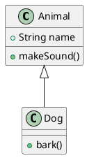
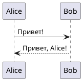

# Пример диаграммы классов

```plantuml
@startuml
class Animal {
  +String name
  +makeSound()
}
class Dog extends Animal {
  +bark()
}
@enduml
```

# Пример диаграммы последовательностей

```plantuml
@startuml
Alice -> Bob: Привет!
Bob --> Alice: Привет, Alice!
@enduml
```